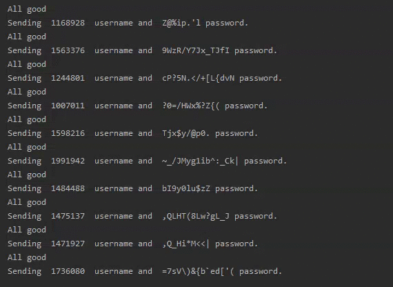
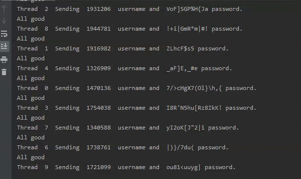
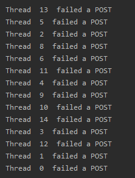
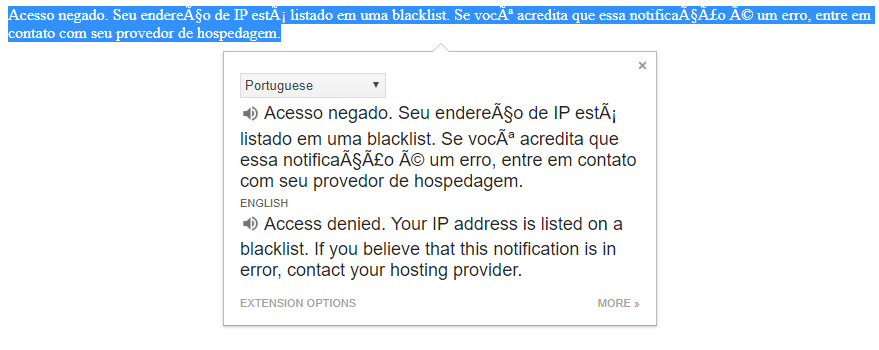
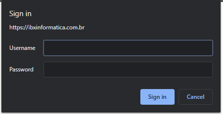

# phish-spammer  

Have you ever woken up after 5 hours of sleep only to fall for a phishing e-mail first thing in the morning?
I did.

I couldn't just let it go as well, so...

# The Plan

Their phishing website does simple POST requests with your inputted data, which would then redirect the user to the legitimate website.
By simply inspecting the headers and payload for one of the requests, you're able to send your own with whatever data you want.
Why not send a bunch of garbage then?

# The Journey

Let's start by sending some garbage their way:

Cool, but way too slow, so let's multithread it:

Now we're talking! In about ~8 minutes I am able to send 1500 garbage payload running 15 threads.

**BUT**, suddenly, tragedy struck and I was met with some unfortunate news:  

Attempting to go to their webpage only confirmed my suspicion:

Oh noes! Unfortunately for them, I was performing all of the requests while connected to a VPN, so simply changing the server allowed me to continue bombarding them with utter trash.

All's well, until around 10 minutes later, all of my threads would return a 401.
...and upon opening the webpage, I was greeted by this:

..and that's how the story concludes. It was fun while it lasted and I hope they will revert the authorization eventually so I could feed them more, but then again, it's probably for the better.

# Conclusion

There are several things that could've been done better, for example:
* Instead of generating completely random passwords, use a dictionary and a combination of words/digits to make it seem more legitimate
* Make sure that only one unique username (ID) is sent, adding to the credibility
* Spread out the requests over time and potentially from differing IPs
